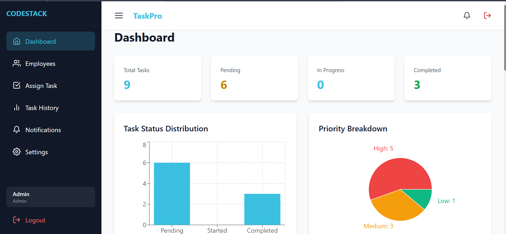
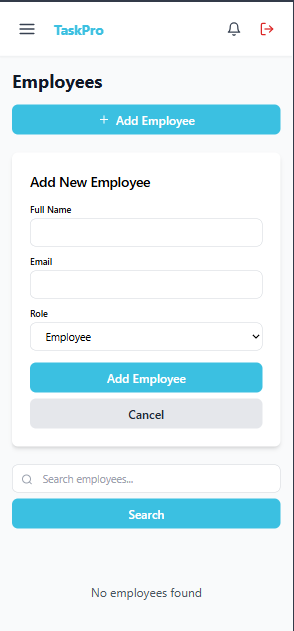

#  TaskPro - Employee Task Management SaaS
🌐 Live Demo: https://taskassignment-0322.vercel.app

Modern task management platform built with the MERN Stack that helps teams assign tasks, track progress, and receive real-time updates.

### ✨ Highlights

* 👨‍💼 Admin & Employee Roles
* 📋 Task Assignment & Tracking
* ⚡ Real-Time Notifications (Socket.io)
* 📊 Productivity Dashboard & Analytics
* 🔐 JWT Authentication & Role-Based Access
* 📱 Fully Responsive Design

### 🛠 Tech Stack

**Frontend:** React.js, Tailwind CSS, Context API, Framer Motion

**Backend:** Node.js, Express.js, MongoDB, Socket.io

**Tools:** Git, GitHub, JWT, Axios

**ScreenShots**


### 🚀 Run Locally

```bash
npm install
npm start
```

### 👨‍💻 Developer

**Hamza Tanveer**
MERN Stack Developer
